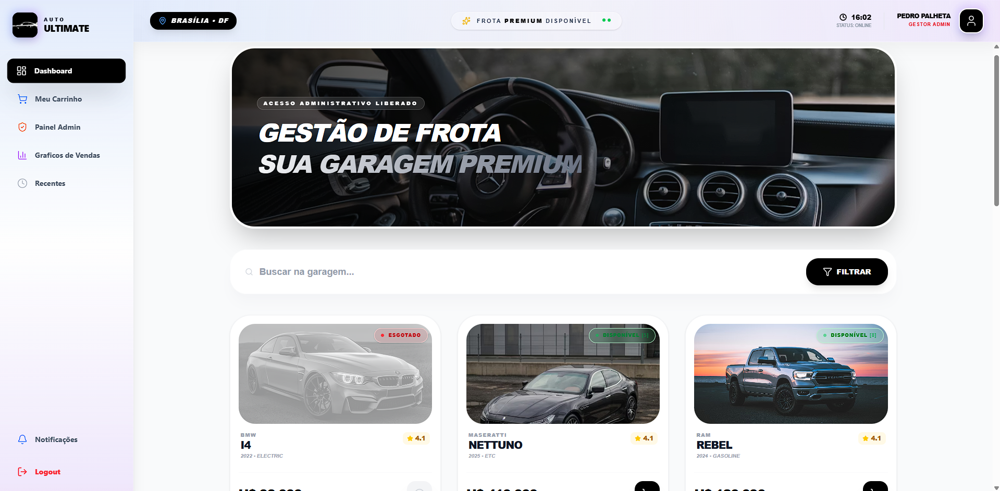
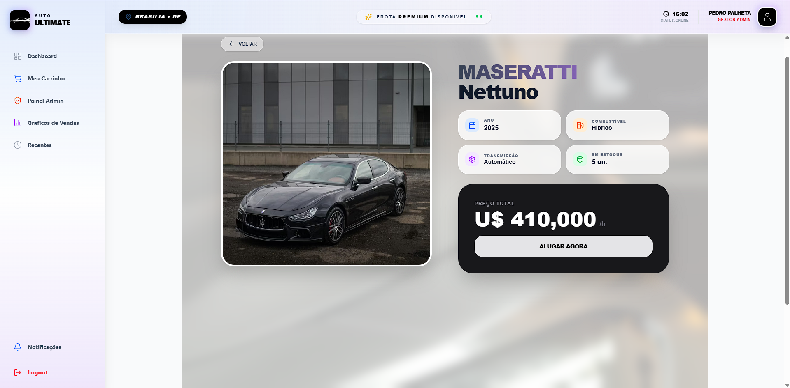
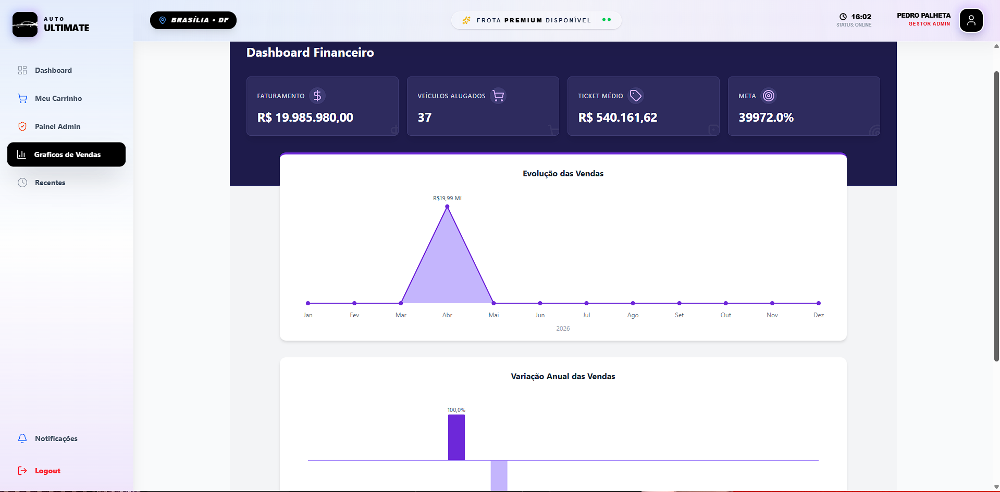
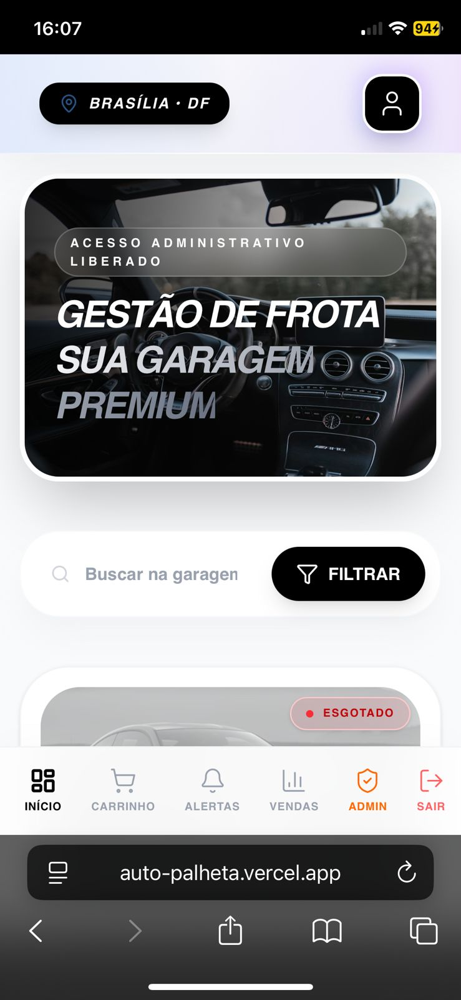
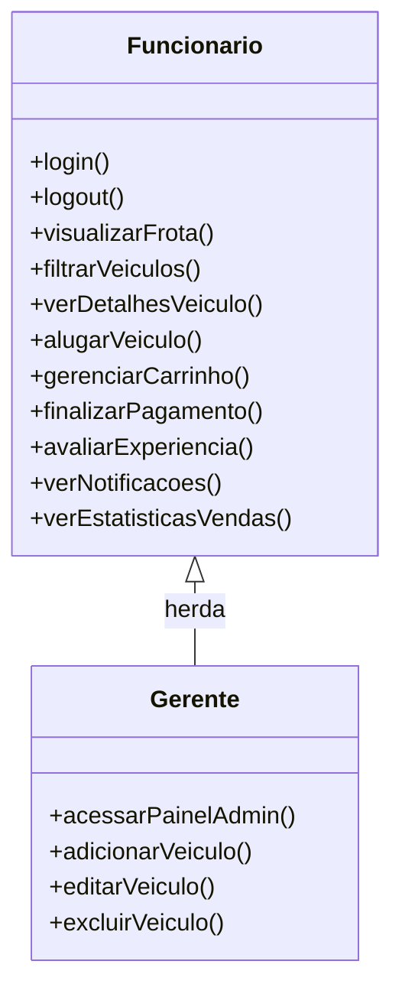
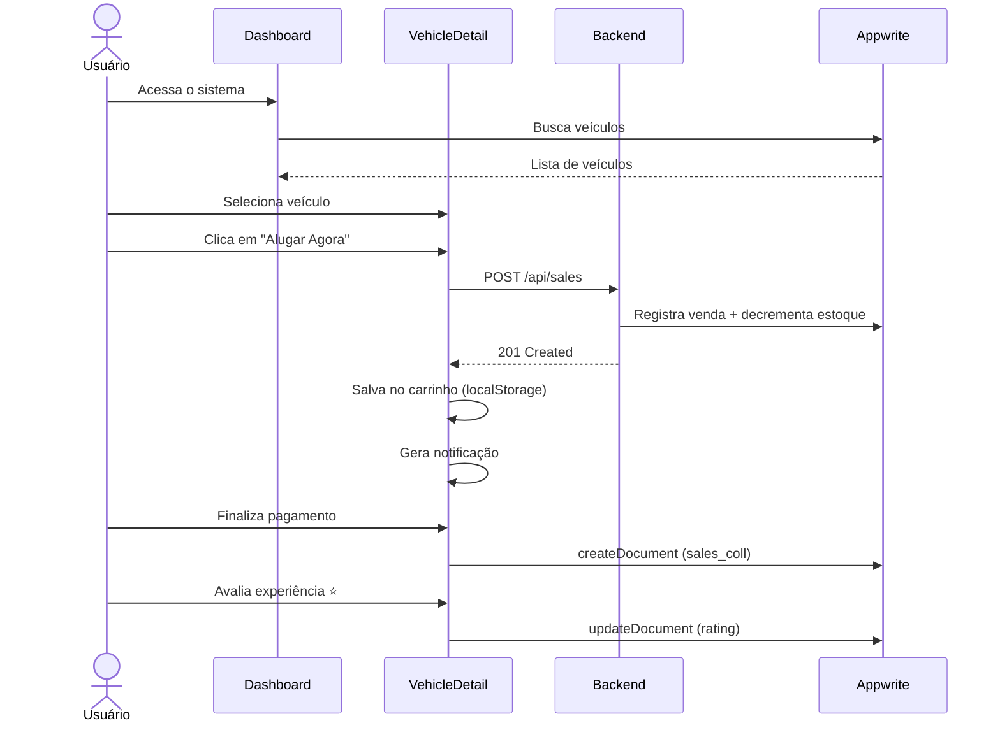

<div align="center">


#  AUTO ULTIMATE
### Sistema de Gestão e Aluguel de Frota Premium

[](https://reactjs.org/)
[](https://vitejs.dev/)
[](https://tailwindcss.com/)
[](https://nodejs.org/)
[](https://appwrite.io/)
[](https://vercel.com/)

**Plataforma web fullstack para gestão interna de frota de veículos premium de uma concessionária.**  
Desenvolvida com foco em UI/UX moderna, controle de acesso por perfil e responsividade total.

##  Acesso para Demo

| Perfil | E-mail | Senha |
|--------|--------|-------|
| 👤 Funcionário | liselinda@gmail.com | teste123456 |
> As contas são de demonstração. Por favor, não altere as credenciais.
[🚀 Ver Demo ao Vivo](https://auto-palheta.vercel.app) · [📄 Análise de Requisitos](#) · [📊 Diagrama UML](#-diagrama-uml)

</div>

---

##  Capturas de Tela

### Dashboard — Vitrine da Frota


### Detalhe do Veículo


### Dashboard Financeiro & Gráficos de Vendas


###  Versão Mobile
<div align="center">
  
</div>

---

##  Sobre o Projeto

O **Auto Ultimate** é um sistema web desenvolvido para concessionárias de veículos premium, permitindo que **funcionários** e **gerentes** gerenciem a frota de forma eficiente e intuitiva.

O sistema conta com dois perfis de acesso distintos, interface responsiva para desktop e mobile, dashboard financeiro em tempo real e fluxo completo de aluguel com avaliação de experiência.

---

##  Funcionalidades

### 👤 Funcionário
-  Login e autenticação segura via Appwrite
-  Visualização da frota com filtros por tipo, combustível e transmissão
-  Busca de veículos em tempo real
-  Página de detalhes do veículo (ano, combustível, transmissão, estoque)
-  Carrinho de aluguel com resumo e finalização de pagamento
-  Avaliação de experiência após o aluguel (1 a 5 estrelas)
-  Notificações em tempo real de ações realizadas
-  Visualização de gráficos e estatísticas de vendas
-  Interface responsiva com bottom navigation no mobile

### 🛡️ Gerente (Administrador) — herda tudo do Funcionário
-  Adicionar novos veículos à frota com upload de imagem
-  Editar informações de veículos existentes
-  Excluir veículos da frota
-  Painel Admin exclusivo (invisível para funcionários)

---

##  Arquitetura

```
AUTO ULTIMATE
├── Frontend (React + Vite + Tailwind)  →  Vercel
│   ├── Pages: Dashboard, VehicleDetail, Cart, SalesStats...
│   ├── Components: Sidebar, BottomNav, Header, VehicleCard...
│   └── Hooks: useAdmin (controle de acesso por role)
│
├── Backend (Node.js + Express)  →  Northflank
│   ├── GET  /api/vehicles  →  Listar veículos
│   ├── POST /api/vehicles  →  Cadastrar veículo
│   ├── PUT  /api/vehicles/:id  →  Editar veículo
│   ├── DELETE /api/vehicles/:id  →  Excluir veículo
│   ├── GET  /api/sales  →  Listar vendas
│   └── POST /api/sales  →  Registrar venda + baixa de estoque
│
└── Appwrite (BaaS)  →  Cloud
    ├── Auth  →  Autenticação + controle de role
    ├── Database  →  vehicles_coll, sales_coll
    └── Storage  →  Upload de imagens dos veículos
```

---

##  Diagrama UML

### Hierarquia de Permissões



### Fluxo de Aluguel



---

##  Stack Tecnológica

| Camada | Tecnologia | Função |
|--------|-----------|--------|
| Frontend | React + Vite | Interface e roteamento |
| Estilização | Tailwind CSS | Design responsivo |
| Backend | Node.js + Express | API REST |
| BaaS | Appwrite | Auth, Banco e Storage |
| Deploy Frontend | Vercel | Hospedagem do frontend |
| Deploy Backend | Northflank | Hospedagem do servidor |

---

##  Como Rodar Localmente

### Pré-requisitos
- Node.js 18+
- Conta no Appwrite
- Conta no Northflank (opcional para backend local)

### Frontend

```bash
# Clone o repositório
git clone https://github.com/Palhetaspedro/auto-ultimate.git

# Entre na pasta do frontend
cd frontend

# Instale as dependências
npm install

# Configure as variáveis de ambiente
cp .env.example .env
# Preencha VITE_API_URL com a URL do seu backend

# Rode o projeto
npm run dev
```

### Backend

```bash
# Entre na pasta do backend
cd backend

# Instale as dependências
npm install

# Configure as variáveis de ambiente
cp .env.example .env
# Preencha APPWRITE_ENDPOINT, APPWRITE_PROJECT_ID, APPWRITE_API_KEY, etc.

# Rode o servidor
npm start
```

---

##  Variáveis de Ambiente

### Frontend (`.env`)
```env
VITE_API_URL=https://seu-backend.northflank.app
```

### Backend (`.env`)
```env
APPWRITE_ENDPOINT=https://sfo.cloud.appwrite.io/v1
APPWRITE_PROJECT_ID=seu_project_id
APPWRITE_API_KEY=sua_api_key
APPWRITE_DATABASE_ID=seu_database_id
APPWRITE_COLLECTION_VEHICLES_ID=vehicles_coll
APPWRITE_SALES_COLLECTION_ID=sales_coll
PORT=3001
```

---

##  Controle de Acesso

O sistema utiliza o campo `role` nas preferências do usuário no Appwrite para diferenciar os perfis:

```json
{ "role": "admin", "user" }
```

O hook `useAdmin` verifica esse campo em tempo real e controla a visibilidade dos elementos exclusivos do gerente (Painel Admin, botão de excluir veículo).

---

##  Estrutura de Pastas

```
auto-ultimate/
├── frontend/
│   ├── src/
│   │   ├── components/     # Sidebar, Header, BottomNav, VehicleCard...
│   │   ├── pages/          # Dashboard, VehicleDetail, Cart, SalesStats...
│   │   ├── hooks/          # useAdmin
│   │   └── lib/            # appwrite.js (config)
│   └── public/             # Assets estáticos
│
└── backend/
    └── src/
        ├── routes/         # vehicles.js, sales.js
        ├── controllers/    # vehicleController.js
        └── config/         # appwrite.js (Node SDK)
```

---

##  Autor

<div align="center">

**Pedro Palheta**  
Desenvolvedor Full Stack

[]((https://www.linkedin.com/in/pedro-palheta-b81017321/))
[]((https://github.com/Palhetaspedro))

</div>

---

<div align="center">
  <sub>Desenvolvido com 🖤 por Pedro Palheta</sub>
</div>
